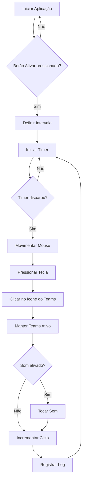
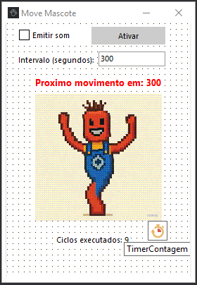

# Mascote

Este repositório contém uma aplicação desenvolvida em **Delphi**.

<p align="center">
  
</p>

## Sobre

O projeto Mascote é uma aplicação criada com Delphi, utilizando componentes visuais e recursos da linguagem Object Pascal.  
**Objetivo:** O Mascote foi desenvolvido para simular atividade no computador, movimentando o mouse, pressionando teclas e interagindo com o Microsoft Teams em intervalos configuráveis. Assim, ele evita que o status do usuário fique como "ausente" em aplicativos de comunicação, sendo útil em situações de trabalho remoto ou reuniões longas.

## Estrutura

- **Fontes**: Os arquivos principais do projeto estão nas extensões `.pas`, `.dfm`, `.dpr`, entre outros.
- **Build**: Pastas como `Win32/`, `Win64/`, `Debug/` e `Release/` são geradas automaticamente e estão ignoradas no versionamento.
- **Backup/Temporários**: Arquivos de backup e temporários também são ignorados pelo `.gitignore`.

## Fluxograma da Lógica

Abaixo está um fluxograma simplificado do funcionamento principal do Mascote:



## Como abrir

1. Abra o Delphi IDE.
2. Selecione o arquivo de projeto (`.dpr`) para carregar a aplicação.

<p align="center">
  
</p>

## Como obter o Delphi e compilar a aplicação

1. **Baixar o Delphi:**  
   Você pode baixar uma versão de avaliação gratuita do Delphi Community Edition no site oficial da Embarcadero:  
   [https://www.embarcadero.com/products/delphi/starter/free-download](https://www.embarcadero.com/products/delphi/starter/free-download)

2. **Instalar o Delphi:**  
   Siga as instruções do instalador para concluir a instalação no seu computador com Windows.

3. **Abrir o projeto:**  
   Após instalar o Delphi, abra o IDE, clique em **File > Open Project...** e selecione o arquivo `.dpr` do projeto Mascote.

4. **Compilar:**  
   Com o projeto aberto, clique em **Run > Compile** ou pressione `Ctrl+F9` para compilar a aplicação.  
   Para executar, utilize **Run > Run** ou pressione `F9`.

5. **Executar:**
   Após a compilação bem-sucedida, você pode executar a aplicação diretamente do Delphi ou localizar o executável na pasta de saída (geralmente `Win32\Debug\` ou `Win64\Debug\`).

## Estrutura de Pastas

```
mascote/
├── README.md
├── LICENSE
├── mascote.gif
├── Mascote.dpr
├── Unit1.pas
├── Unit1.dfm
├── Win32/
│   └── Debug/
│       ├── Mascote.exe
│       └── cycle_log.txt
├── Win64/
│   └── Debug/
│       └── Mascote.exe
├── image/
│   ├── mascote.png
│   └── mascote_delphi.png
```
- **mascote.gif**: Imagem do mascote, deve estar no mesmo diretório do executável gerado.
- **Win32/Debug/** e **Win64/Debug/**: Pastas onde o Delphi gera os executáveis e logs.
- **image/**: Imagens usadas na documentação.

## Requisitos

- Delphi (qualquer versão compatível com o projeto)
- Windows

## Contribuição

Sinta-se à vontade para contribuir com melhorias, sugestões ou correções através de *pull requests*.

## Licença

Este projeto está licenciado sob a licença [MIT](LICENSE).

## Observação Importante

> **Atenção:**  
> Para evitar o erro `Cannot open file "mascote.gif"`, certifique-se de que o arquivo **mascote.gif** esteja presente no mesmo diretório onde o executável da aplicação é gerado (por exemplo, na pasta `Win32\Debug\` ou `Win64\Debug\`).  
> Caso contrário, a aplicação não conseguirá carregar a imagem do mascote e exibirá uma mensagem de erro ao iniciar.

## Relatórios com o arquivo `cycle_log.txt`

O arquivo `cycle_log.txt` é gerado automaticamente na mesma pasta do executável (`Win32\Debug\` ou `Win64\Debug\`) e registra cada ciclo executado pelo Mascote, incluindo a data, hora e o total de ciclos até aquele momento.

Você pode utilizar esse arquivo para:

- **Auditoria de uso:** Verificar quantas vezes e em quais horários o Mascote executou ações.
- **Análise de produtividade:** Avaliar períodos de atividade simulada no computador.
- **Geração de relatórios personalizados:** Importar o arquivo em planilhas (Excel, Google Sheets) ou ferramentas de análise para criar gráficos ou relatórios detalhados sobre o uso do Mascote.

O arquivo é salvo em formato texto simples, facilitando sua leitura e manipulação por outros programas.
